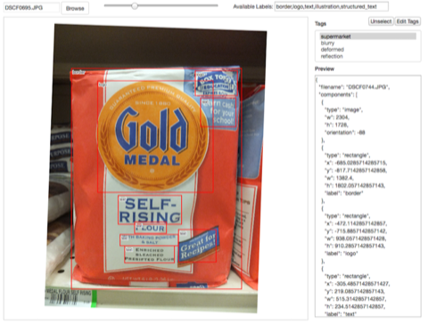

# Extracting informative graphics from packaging designs

This is my CS 543 (Computer Vision) project. I currently have no plans for maintaining this
repository, but I'm sharing with my classmates and friends.

In short, the goal of this project is to detect regions of product packaging designs that catch people's attention.
I thought it would be interesting to work with artificial graphics (rather than scene-based data) to try to solve
a non-standard object detection problem. Part of the write-up for the assignment is available [here](./docs/cs543.md)

## Examples

I implemented a sliding image window detector based on the Histogram of Oriented Gradients and basic "objectness" features such as
color histogram distances.


Given a region of interest (blue square in the figure), the code computes inverse chi-square distances of LAB space color histogram from
its immediate surroundings - two levels (yellow and green boundaries) in this example - and the entire image to measure the object-like quality.

Combined with the Histogram of Oriented Gradients and normalized size and location features, we can train multi-step classifiers to
detect eye-catching parts of an image. See [this file](https://github.com/daeyun/cs543project/blob/master/src/feature_extractor/hog_obj_feature_extractor.py) or [this file](https://github.com/daeyun/cs543project/blob/master/src/sliding_window/sliding_window_detector.py) for implementation.

The first classifier (SVM trained for high-recall and low precision) is a bit messy.


Now we feed in the selected windows to a high-precision classifier (another SVM).


Now use OpenCV's `groupRectangles` function to merge them.


This one happens to be a particularly good example, and it doesn't always work this well. :)

A less consistent one:


## Data collection and annotation

Going to a supermarket and taking photos at 5 AM was a fun experience. Then I wrote a web-based annotation tool (available [here](https://github.com/daeyun/fast-image-annotation-toolkit)) and
annotated them like the figure below. After marking 239 images, I was able to collect a reasonable amount of training data.



Although the annotations include multiple categories, the detector was only trianed to detect logos and illustrations combined into one category.
If you're interested in detecting
text, OpenCV has a [scene text detection](http://docs.opencv.org/trunk/modules/objdetect/doc/erfilter.html) implementation that works surprisingly well.
At the time of writing, this is only available in the development version, so you'll have to clone the latest OpenCV code from GitHub and compile
from source.


# Dependencies

## Mac

Install opencv

```
brew install opencv
```

Symlink to the virtual environment

```
ln -s /usr/local/lib/python2.7/site-packages/cv2.so /usr/local/lib/python2.7/site-packages/cv.py ./env/lib/python2.7/site-packages
```

See setup.py for other requirements.
